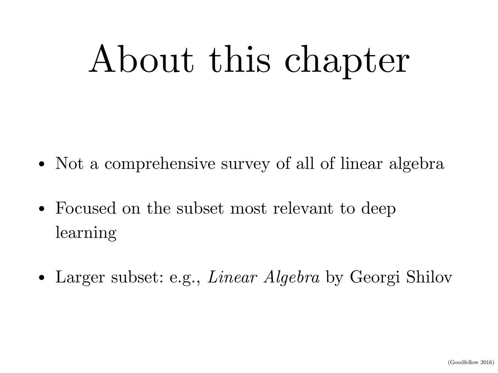
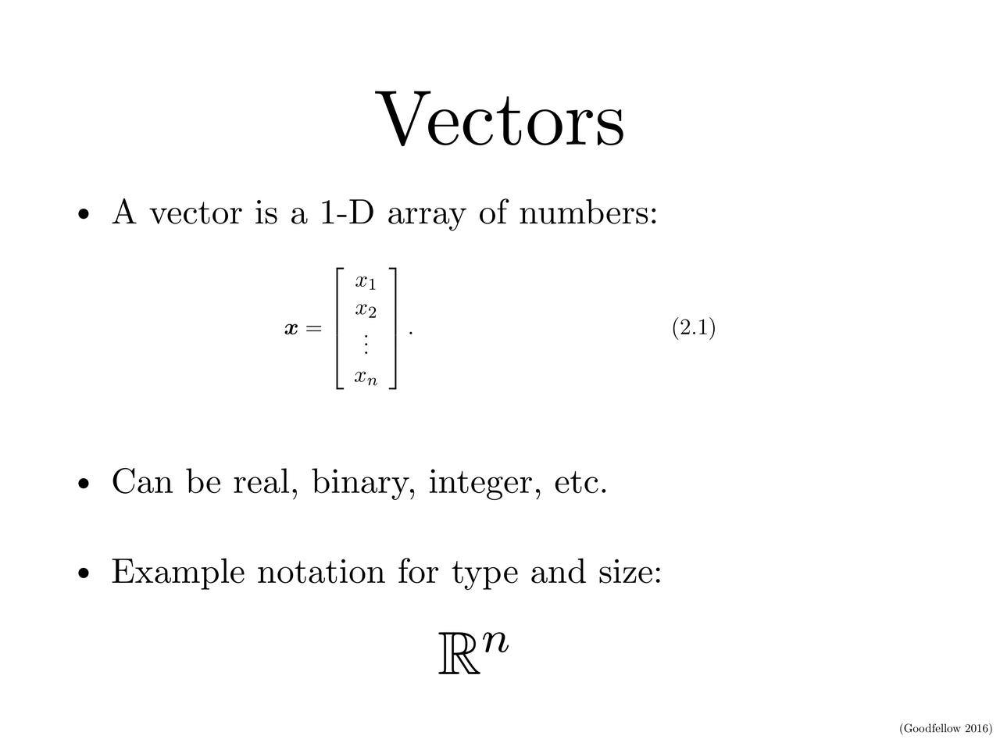

# pdf2images
Convert PDF file to image files **ROBUSTLY**.

# Example
```
$ pdf2images -h
usage: pdf2images [-h] [--max-size MAX_SIZE] pdf_file output_dir

positional arguments:
  pdf_file
  output_dir

optional arguments:
  -h, --help           show this help message and exit
  --max-size MAX_SIZE  max size of either side of the image
```

# Why another "pdf-to-image" package
Once in a while, I need to convert a pdf file (usually slides or academic
paper) into image files (thumbnails) in order to get a fast glance to the
readers without downloading the pdf file.

However, I found all the pdf2image solutions cannot robustly process all the
pdf files, since many pdf files are in non-standard format or come up with
extensions. They are always broken in some cases.

But to look them on the bright side, for any plausible case, there is almost
one of them can process it successfully.

So I combined (a.k.a. *ensemble*) them together to make it work across most cases.

# Installation
As mentioned above, we combined multiple pdf manipulation libraries. Here are
the list of the libraries used:
- [wand](http://docs.wand-py.org), an ImageMagick python wrapper.
- `pdftotext` command line tool provided by [xpdf](http://www.xpdfreader.com/)
- [preview-generator](https://github.com/algoo/preview-generator)
- [qpdf](https://github.com/qpdf/qpdf)

where wand and preview-generator are python packages that can be automatically
installed along with pdf2images. However, you have to install xpdf and qpdf
manually.

On Ubuntu:
```
sudo apt install -y qpdf xpdf libimage-exiftool-perl
```

On Arch Linux:
```
sudo pacman -S --noconfirm qpdf xpdf perl-image-exiftool
```

On macOS:
```
brew install freetype imagemagick qpdf xpdf exiftool libmagic ghostscript
```

The installation of pdf2images is quite simple:
```
pip install pdf2images
```

# Robustness
This package has successfully processed hundreds of thousands of arxiv papers
(for generating thumbnails).


# Gallary
The following images are converted from a [slide](https://www.deeplearningbook.org/slides/02_linear_algebra.pdf) from [Deep Learning Book](https://www.deeplearningbook.org/lecture_slides.html)






# Development
```
pip3 install -r requirements.dev.txt
pre-commit install
```
